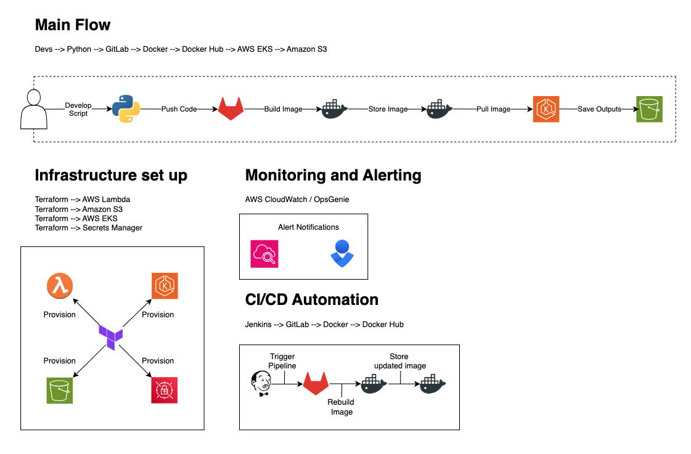

# :tada: Clickbait Headline Generator :newspaper:

## :rocket: Create a Headline Generator and Create a CI/CD Pipeline with Storage for the Outputs

---

## :thinking: Task Overview

To build this pipeline, first, you'll create a Python script capable of generating outrageous, eye-catching headlines based on commonly seen ‘hot’ topics. Think along the lines of:

- :moneybag: _"The Latest **Get Rich Quick** Scheme That Has Experts Fuming!"_
- :loudspeaker: "You Won’t Believe What Happened When..."
- :zipper_mouth_face: "Celebrity Secrets They Tried to Hide!"

To generate these masterpieces, you'll use lists of predefined constants—such as pronouns, nouns, places, and time phrases (_home, bank, office, now, soon, next week, etc._).

:tophat: **Fun fact:** The first step of this pipeline takes inspiration (_okay, a lot of it..._) from Al Sweigart's fantastic, free online resource: [**Big Book of Small Python Projects**](https://inventwithpython.com/bigbookpython/).
:books: (There’s plenty in there to tinker with, so if you get stuck, you might find some handy hints. But try your own approach first!)

Once your generator works locally, the real fun begins—building a beginner-friendly CI/CD pipeline! :tada:
(Disclaimer: "Beginner-friendly" doesn’t always mean _easy_—your mileage may vary!)

---

## :building_construction: What Are You _Actually_ Building?

**Great question! Let me walk you through it...**

You’re setting up a pipeline that:

- :white_check_mark: Starts with a Python script
- :white_check_mark: Generates an archive of randomised clickbait headlines
- :white_check_mark: Stores those headlines in an S3 bucket

:pushpin: Here's a high-level overview of what you're building:

## :hammer_and_wrench: What Now?

To align with the team's commonly used tools, here are the key steps for building your pipeline:

### :snake: 1. Python Script Development

- :small_blue_diamond: Develop a simple Python script that generates clickbait headlines and saves them to a file.
- :small_blue_diamond: Use the `random` module to create variations.

### :building_construction: 2. Version Control with GitLab

- :open_file_folder: Organise your repository properly: separate directories for Python scripts, Terraform configurations, and Kubernetes manifests.
- :memo: Write clear documentation—your future self (and teammates) will thank you!

### :whale: 3. Dockerising Your Application

- :hammer_and_wrench: Create a `Dockerfile` to package your script into a container.
- :gear: Run it on AWS Lambda with Docker installed.
- :arrows_counterclockwise: Once it's running smoothly, prepare to automate everything with Jenkins!

### :arrows_counterclockwise: 4. Continuous Integration with Jenkins

:white_check_mark: Set up pipeline stages for:

- :white_check_mark: Code linting
- :white_check_mark: Unit testing (consider `pytest`)
- :white_check_mark: Building and deploying

### :cloud: 5. AWS Infrastructure with Terraform

- :seedling: Start with a basic Terraform setup and expand as needed.
- :package: Store outputs in an S3 bucket.

### :office: 6. Kubernetes Deployment (Optional, but fun!)

- :pushpin: If deploying to EKS, check out the Confluence resources for guidance.

### :robot: 7. Automating the Pipeline

- :hammer_and_wrench: Use Jenkins to handle builds, tests, and deployments.
- :closed_lock_with_key: Store secrets securely (e.g., AWS Secrets Manager).

### :bar_chart: 8. Monitoring and Alerting

- :chart_with_upwards_trend: Start with AWS CloudWatch.
- :rotating_light: Add OpsGenie later for alerting, but **avoid alert fatigue!**

### :lock: 9. Security and Compliance

- :white_check_mark: Apply the **least privilege principle** for your S3 bucket.
- :key: Use IAM roles and policies for access control.
- :lock: Enable encryption for data at rest and in transit.

### :open_book: 10. Document Everything!

- :memo: Track each step, from challenges to solutions.
- :books: Learning as you go? That’s the point! Embrace the process.

---

## :dart: Ready to Get Started?

- :fire: Clone the repo.
- :rocket: Start coding.
- :sparkles: Generate the most absurd headlines imaginable! :sparkles:

---
